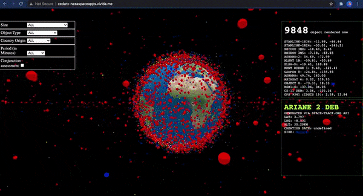

# Track Space Trash in Real Time

<i>This project is a part of the competition done by https://www.spaceappschallenge.org/</i>

Check a demo under http://cedarx-nasaspaceapps.vivida.me/

# Introduction
The increasing amount of debris orbiting Earth could potentially limit our access to space, impacting not only exploration efforts, but routine aspects of our life on Earth. Our project is an open-source application that displays and locates known debris object orbiting the earth visualized on a 3D globe. Filters and conjunction assessment feature are added to help users facilitate tracking and anticipate risks of collision. All space agencies around the world intend to help predicting and solving human-kind problems, however without putting efforts on locating and cleaning up the debris mess out there, all other space missions become hopeless.

# Technology used
 This project is open source under the MIT licence, data are extracted from SpaceTrack.com.
 The project is web based, built on top of HTML, CSS, and JavaScript, we intentionly tried to keep it simple and tried to not depends on high level library for simplicity and ease of extension later on.

Here is a list of the libraries used:
 - Three.js
 - three-globe
 - satellite.js
 - three-interaction.js
 - lodash
 - date-fns

check the package.json file for more detailed info.

# Team members
 - Miriam Matar
 - Manuel Richa
 - Hassan Kassem
 - Emile Zamir
 - Ahmad Moussawi

# Data Source
The data was provided by Space Track, below are simple request example used to download the information

curl -c -k https://www.space-track.org/ajaxauth/login -d 'identity=cedarxteam@gmail.com&password=CedarXteam2021Leb&query=https://www.space-track.org/basicspacedata/query/class/gp/predicates/OBJECT_ID,OBJECT_NAME,NORAD_CAT_ID,OBJECT_TYPE,PERIOD,INCLINATION,APOGEE,PERIGEE,ECCENTRICITY,MEAN_MOTION,SEMIMAJOR_AXIS/emptyresult/show/format/json&limit=10'

curl -c -k https://www.space-track.org/ajaxauth/login -d 'identity=cedarxteam@gmail.com&password=PASSWORD_HERE&query=https://www.space-track.org/basicspacedata/query/class/gp/predicates/OBJECT_ID,OBJECT_NAME,NORAD_CAT_ID,OBJECT_TYPE,PERIOD,INCLINATION,APOGEE,PERIGEE,ECCENTRICITY,MEAN_MOTION,SEMIMAJOR_AXIS/emptyresult/show/format/json'

curl -c -k https://www.space-track.org/ajaxauth/login -d 'identity=cedarxteam@gmail.com&password=PASSWORD_HERE&query=https://www.space-track.org/basicspacedata/query/class/gp/predicates/OBJECT_ID,OBJECT_NAME,NORAD_CAT_ID,OBJECT_TYPE,PERIOD,INCLINATION,APOGEE,PERIGEE,ECCENTRICITY,MEAN_MOTION,SEMIMAJOR_AXIS/emptyresult/show/format/json'